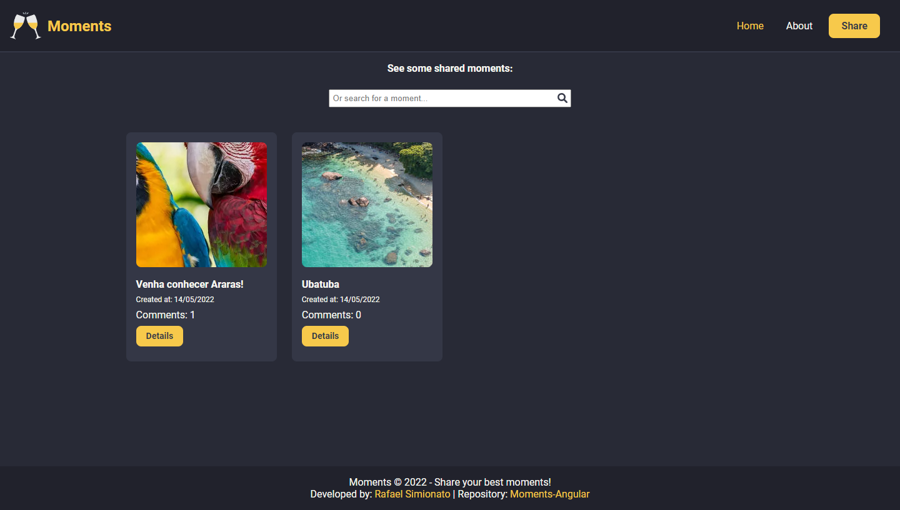
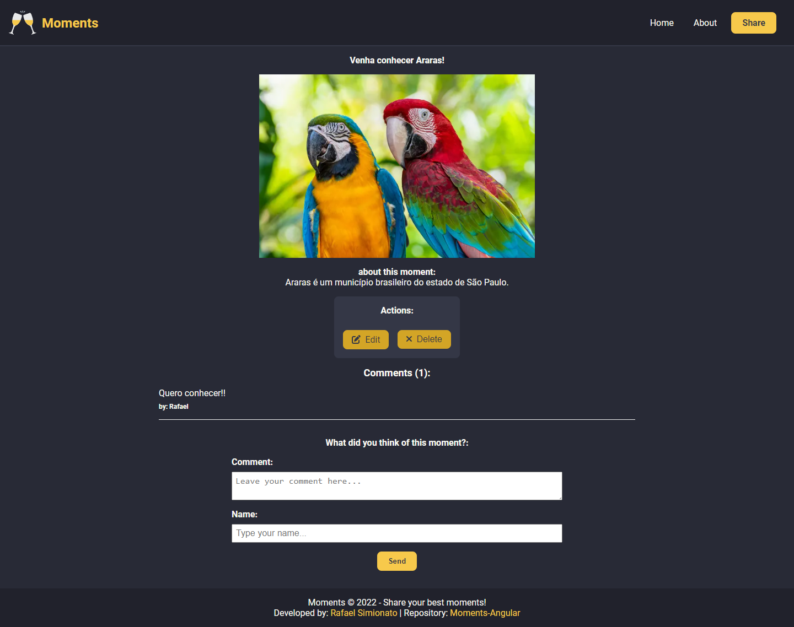
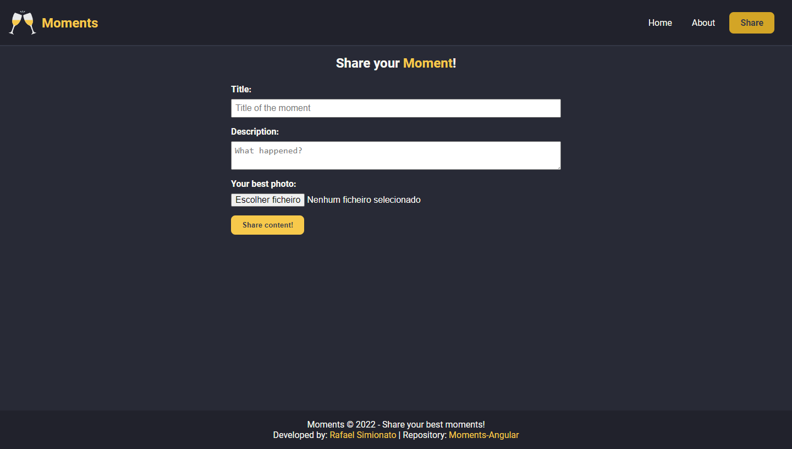

<p align='center'></p>
<h1 align='center'>Moments</h1>
<p align='center'>


</p>

## 🔖 Descrição
<p>🍾 Criação da aplicação "Moments" criada no curso de Angular do canal Hora de Codar. Projeto criado para aprender os conceitos básicos do Angular.<p>

## ⚙️ Funcionalidades
- Visualização de todos os momentos criados
- Cadastro de novos momentos
- Visualização dos momentos indivudualmente
- Tela de edição dos momentos cadastrados
- Possibilidade de inserir comentários

## 🚀 Tecnologias
Esse projeto está utilizando as seguintes tecnologias:
- HTML
- CSS
- JavaScript
- [Angular](https://angular.io/)
- [Typescript](https://www.typescriptlang.org/)
- [Rxjs](https://rxjs.dev/)
- [API Restful com AdonisJS](https://www.youtube.com/watch?v=y8XfJJYhXPE)


## 🎲 Como utilizar
### Clone esse repositório
```bash
git clone https://github.com/rafaasimi/moments-angular.git
```
### Navegue até o diretório
```bash
cd moments-angular
```
### Instale as dependências
```bash
npm i
```
```bash
yarn
```
### Inicie a aplicação
```bash
ng serve
```


## 🖼️ Layout





## 📝 Licença
<p>O projeto se encontra sob licença MIT. Para mais detalhes, acesse <a href='LICENSE'>license<a>.</p>

---
<p>Criado com 💙 por <a href='https://github.com/rafaasimi/' target='_blank'>Rafael Simionato</a></p>